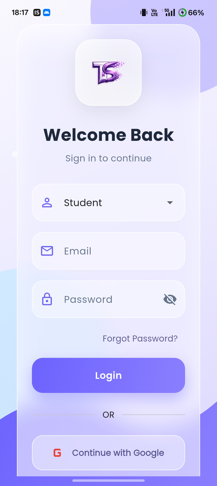
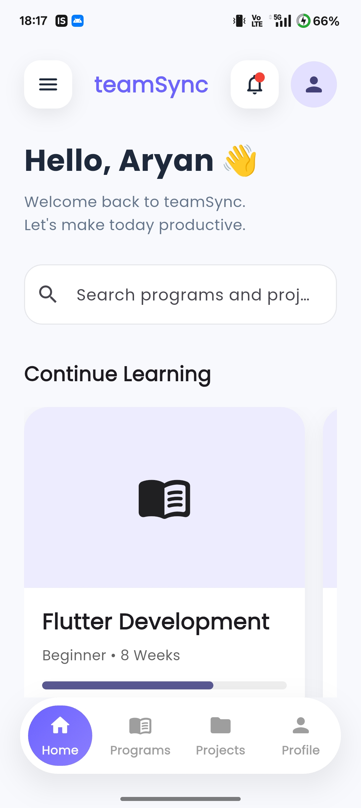
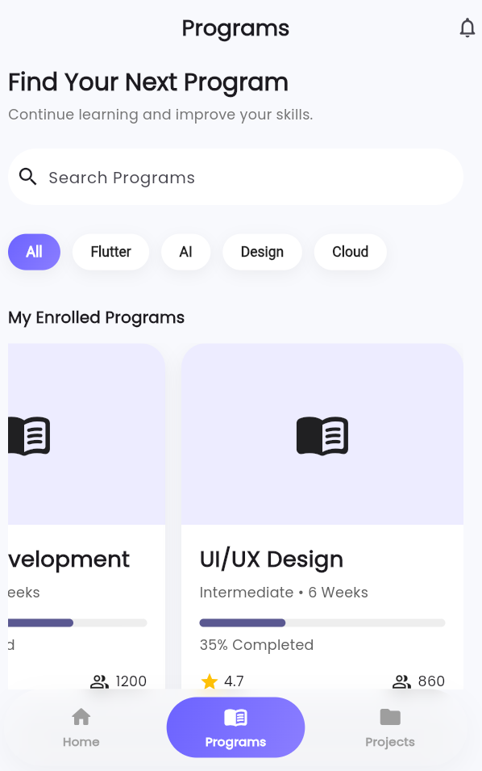
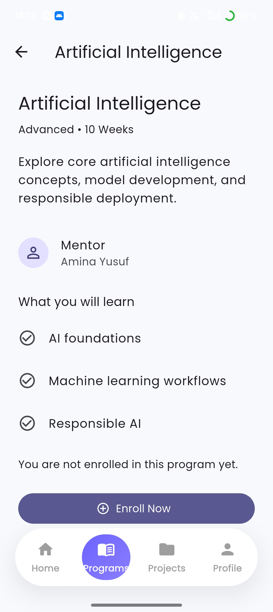

# teamSync

A dedicated mobile project tracking application designed to streamline workspace management and deliverable tracking for virtual interns.

## Purpose & Objective
The primary objective of **teamSync** is to bridge the gap between complex web-based project dashboards and mobile productivity. By transforming dense group tracks and milestone timelines into an intuitive, mobile-first interface, teamSync allows users to view synchronized team progress, track strict sprint deadlines, and coordinate project management tasks seamlessly on the go.

## Target User Roles
*   **Learners / Interns:** Access localized group workspaces, monitor completion percentages, and review exact criteria for required milestone submissions.
*   **Admins / Managers:** Track team-wide sprint completion, oversee project timelines, and manage multi-tier track deliverables.

## Core Features
*   **Authentication & Auto-Sync:** Recognizes user identity at login to automatically pull and synchronize the specific team track workspace tied to that user's profile email.
*   **Phase-Driven Milestone Tracking:** Groups project progress into clean, interactive weekly timelines that focus heavily on actionable deliverables over static documentation.
*   **Sprint Breakdown Checklists:** Offers a granular look into specific task requirements, sub-tasks, and individual milestone completion statuses.
*   **Adaptive View Filters:** Allows users to parse tasks instantly by completion state (All, In Progress, Completed, Planning) to maximize focus.

## Application Architecture & User Flow

The navigation pipeline utilizes role-based routing payloads to serve specific dashboard layouts depending on the user type:

```text
[ Login Screen ]
    |
    ▼ (Passes Input Name & Role Payload)
[ Home Dashboard Route ]
    |
    ├─► Learner Workspace: Personalized Header Greeting ("Hello, [Input Name]!")
    |   └─► Displays Urgent Deadlines & Program Track Task Navigation
    |
    └─► Admin Portal: Personalized Header Greeting ("Hello, [Input Name]!")
        └─► Displays Global Stat Rows, Cohort Summaries, & System Status


```


---
# Week 2 Progress

## Working UI Prototype

The low-fidelity wireframes created in Week 1 have been transformed into an interactive Flutter prototype using Material 3 design principles.

### Implemented Screens

- ✅ Login Screen
- ✅ Home Dashboard
- ✅ Program Listing Screen
- ✅ Program Details Screen

All screens are connected through Flutter navigation, allowing users to move seamlessly between the application's core features.

---

## Features Implemented

### Authentication
- Login interface
- Learner/Admin role selection
- Google Sign-In UI
- Responsive Material 3 layout

### Home Dashboard
- Personalized greeting
- Search functionality
- Continue Learning section
- Active Programs preview
- Active Projects preview
- Upcoming Tasks
- Persistent bottom navigation

### Program Listing
- Program cards
- Category filters
- Progress indicators
- Search interface
- Continue Learning actions

### Program Details
- Program overview
- Difficulty level
- Duration
- Progress tracking
- Learning information

---

## Navigation Flow

```text
Login
   │
   ▼
Home Dashboard
   │
   ├── Program Listing
   │        │
   │        ▼
   │  Program Details
   │
   └── Dashboard Sections
```

---

## Screenshots

The following screenshots showcase the current implementation of the Week 2 UI prototype.

<table>
<tr>
<td align="center">
<br>
<b>Login Screen</b>
</td>
<td align="center">
<br>
<b>Home Dashboard</b>
</td>
</tr>

<tr>
<td align="center">
<br>
<b>Program Listing</b>
</td>
<td align="center">
<br>
<b>Program Details</b>
</td>
</tr>
</table>
---

## Technologies Used

- Flutter
- Dart
- Material 3
- Google Fonts

---

## Project Structure

```text
lib/
├── core/
├── data/
├── models/
├── routes/
├── screens/
│   ├── login/
│   ├── home/
│   └── programs/
├── services/
└── widgets/
```

---

## Current Development Status

| Module | Status |
|---------|--------|
| Login | ✅ Complete |
| Home Dashboard | ✅ Complete |
| Program Listing | ✅ Complete |
| Program Details | ✅ Complete |
| Navigation | ✅ Complete |
| Responsive UI | ✅ Complete |

---

This repository represents the Week 2 deliverable for the **Excelerate Mobile App Development with Flutter Virtual Internship**, demonstrating the transition from low-fidelity wireframes to a functional Flutter UI prototype.

