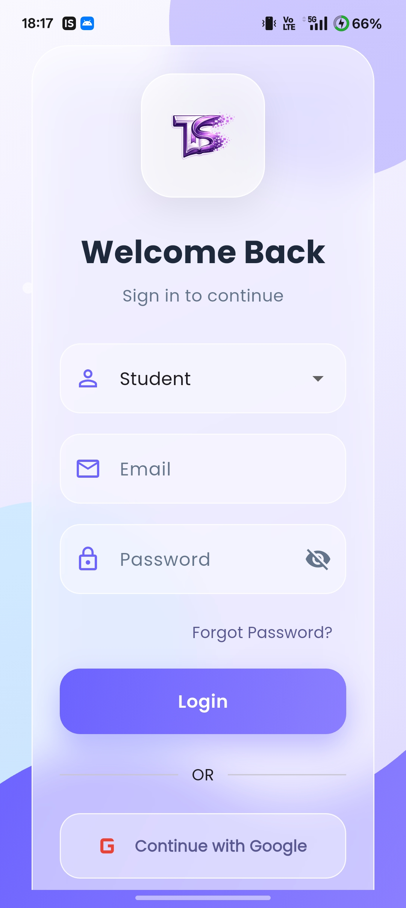
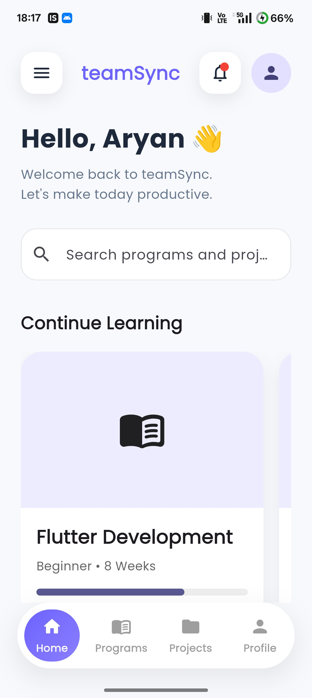
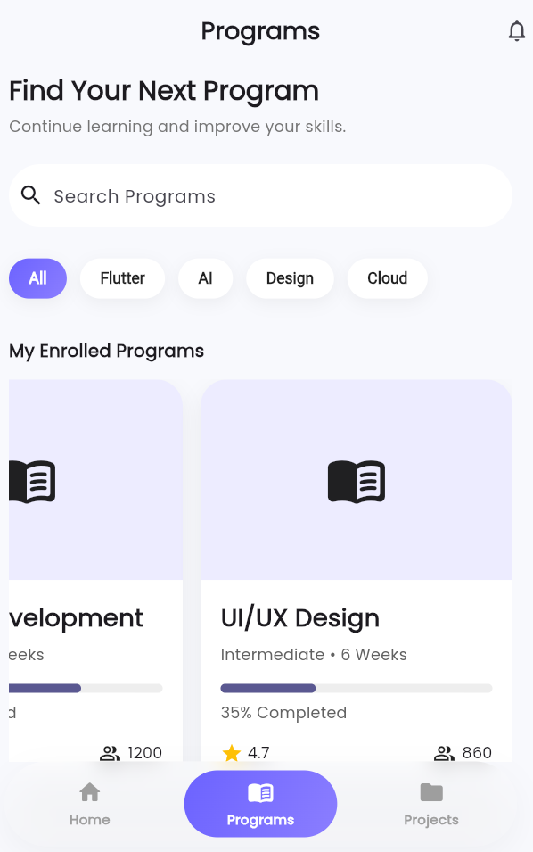
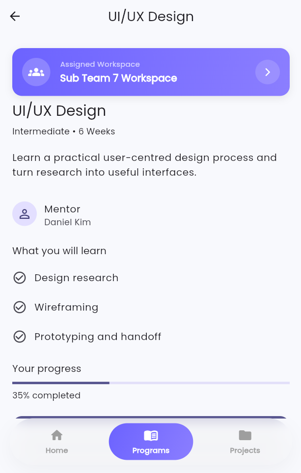

# teamSync

teamSync is a Flutter mobile app for internship and team workflow tracking. It combines login, role-based navigation, program browsing, program details, feedback submission, and team workspace views into a single polished mobile UI.

## Project Overview

The app is built for two roles:

- Learner: sees the home workspace, programs, projects, team dashboard, and profile actions.
- Admin: sees the admin dashboard, users, programs, and reports tabs.

The app is fully local for the internship demo. It uses mock JSON data and local session storage instead of a live backend.

## Purpose

The goal of teamSync is to provide a clean mobile-first experience for:

- checking current work and progress
- browsing programs and program details
- submitting feedback
- moving between screens quickly with consistent navigation

## Features

- Role-based login and signup
- Remember me login persistence
- Learner and admin navigation shells
- Swipe gesture tab switching
- Animated tab transitions
- Predictive back support on Android
- Double-back exit confirmation
- Bottom-sheet profile popup
- Team dashboard with compact chat flow
- Program listing and program details
- Feedback form with validation
- Shared mock JSON data source

## Screenshots

| Login | Home |
| --- | --- |
|  |  |

| Programs | Program Details |
| --- | --- |
|  |  |

## Setup Instructions

### Prerequisites

- Flutter SDK installed
- Android Studio, VS Code, or another Flutter-compatible IDE
- Android emulator or physical device

### Run the app

```bash
flutter pub get
flutter run
```

### Build for Android

```bash
flutter build apk
```

## Test Accounts

The app works with local mock credentials saved on the device. You can also use the demo login during testing.

- Demo email: `demo@teamsync.com`
- Demo password: `Demo@123`

## Repository Structure

```text
lib/
├── core/
├── data/
├── screens/
│   ├── admin/
│   ├── home/
│   ├── login/
│   ├── programs/
│   ├── projects/
│   ├── register/
│   └── teams/
└── widgets/
assets/
├── data/
└── screenshots/
```

## Changelog

### 2026-07-28

- Added admin navigation pages and admin bottom navigation.
- Added bottom-sheet profile popup and compact profile actions.
- Fixed team dashboard navigation and chat placement.
- Added predictive back support and double-back exit confirmation.
- Added remember me login persistence and app launch restore.
- Added swipe-based tab switching with slide animation.
- Polished bottom navigation visuals and global route flow.

### Earlier milestones

- Connected program listing and program details to JSON-backed mock data.
- Added feedback form validation and submission flow.
- Refined the home dashboard and workspace layout.
- Added local registration and account-backed profile data.

## Contribution Log

This repository was updated in clear feature phases during the final build session:

1. Admin workspace and navigation cleanup
2. Profile sheet and compact account actions
3. Team dashboard and chat flow fixes
4. Predictive back and exit behavior
5. Remember me login persistence
6. Swipe tab switching with slide animation
7. Final README and release cleanup

## Notes

- This is a local demo app for the internship submission.
- No live backend is required for the final version.
- All shared navigation and profile behavior is handled in-app.
